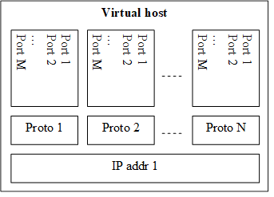

= IPL4asp Test Port for TTCN-3 Toolset with Java TITAN, Description
:author: Gábor Szalai
:author: Gergo Ujhelyi
:toc:

== Functionality

The IPL4asp is a general purpose, session independent test port providing access to several transport layers over the Internet Protocols in an extensible manner. The most important features are the support of multiple IP addresses of both IPv4 and IPv6 and that the user of the test port can extend the base functionalities with session specific ones using either TTCN or external Java function.

The IPL4asp test port has been demanded by projects to produce very high load, therefore performance must always be a key factor during the design and implementation.

The IPL4asp test port will replace the earlier UDP, TCP with SSL support and SCTP test ports, providing backward compatibility as far as possible, in order to reduce maintenance efforts.

=== Supported Internet Protocol Version

The IPL4asp test port shall support both currently used Internet Protocol versions, i.e. IPv4 and IPv6. The version of the Internet Protocol shall be hidden at the level of the test port API (see <<Use_of_DNS_Names_and_IP_Addresses, Use of DNS Names and IP Addresses>>.

=== Several Transport Protocols

The IPL4asp test port shall support the UDP, TCP, TCP with SSL and SCTP transport layer (L4) protocols. The test port shall be designed in an extensible manner that other transport protocols can be added without modifying the framework and the test port API.

=== Backward Incompatibilities

The following backward incompatibilities exist (R1A -> R2A):

* Java version based on the R2A implementation there for R1A tests may require update.
* The Result record was modified to include two more optional fields. This may require update of code if templates for Result are used or a variable of Result type is assigned a value.
* The expected behavior of the callback function, registered with `f_IPL4_setGetMsgLen`, has been slightly modified - If the callback function returns a length bigger than the message part in the octetstring, then this value is stored and used later without calling the callback function again for the given message.
* The definition of Connection ID is modified - It is a test port component level unique identifier of the connection. It is not guaranteed to be a file descriptor. The connection ID identifies also the protocol.

=== Platform Dependencies and Limitations

The following table indicates which functionalities are available on different platforms:

[%header,cols=3*]
|===
| |*Linux* |*Windows*
|*IPv6* |*X* |*X*
|*Network interface setup* |*X* |*X*
|*IP address discovery* |*X*|*X*
|*Connection options* 3+^.^|*All* – See <<Parameters_for_IP_Auto-Configuration, Parameters for IP auto-configuration>>|
|*SCTP support* |*X* |
|=================================================

IP address discovery not supported in Java.

For guidance on building the test port and for compilation options see <<Installation_and_Building_the_Test_Port, Installation and Building the Test Port>>.

In order to take advantage of the SCTP support in IPL4 test port the following platforms can be used:

* Solaris 10

* Suse Linux 9.1 and above with SCTP packages installed as in <<system_requirements, System Requirements>>.

On Ubuntu 8.10 one of the standard API calls used in the test port may block the execution for several seconds. This is a known issue with Ubuntu which may be resolved by applying the latest updates to the OS. To overcome this problem a workaround has been implemented. If specific IP addresses are used in a valid dot notation form instead of domain names, no DNS name resolution is needed, and no calls made to the faulty function.

[[system_requirements]]
=== System Requirements

In order to operate the IPL4asp test port the following system requirements must be satisfied:

* TITAN TTCN-3 Test Executor version R8A (1.8.pl0) or higher installed. For installation guide see <<_2, [2]>>.

NOTE: The usage of TITAN releases earlier than R8A can result a dynamic test case error.

* The following functions from TCC Useful Functions <<_4, [4]>> are required:
+
`TCCInterface_Functions` (__TCCInterface_Functions.ttcn__, _TCCInterface.cc_)

* The BSD socket interface must be supported, which should be present in most UNIX-like operating systems, such as Solaris, Linux and Cygwin.
* Root privileges are required when using automatic IP address discovery or IP address configuration.
* For SCTP support the following SCTP Linux Kernel implementation packages (or higher version) should be installed:
+
[source]
----
lksctp-tools-1.0.1-2.i586.rpm

lksctp-tools-devel-1.0.1-2.i586.rpm
----

* If SSL is used, the same OpenSSL must be installed as used in TITAN. For an OpenSSL installation guide see <<_5, [5]>>.
* Several functions rely on the OpenSSL library so the used OpenSSL version should support the required functionality. Please consult the OpenSSL manual for the exact versions.
** The available chippers and SSL/TSL/DTLS versions depends on the OpenSSL versions. Check the OpenSSL manual
** For DTLS support OpenSSL 1.0.1 or later version must be installed.
** For DTLS over SCTP the OpenSSL 1.0.1q or later versions is required and the Linux kernel version >= 3.13.0. +
The OpenSSL library must be compiled with SCTP support (which is disabled by default). +
The net.sctp.auth_enable kernel setting must be set to 1.
** For PSK support OpenSSL 1.0.2 or later version is required

== Feature List

The features enumerated below have been implemented in the test port.

=== Transport Protocol Extensibility

The test port is designed in an extensible manner that other transport protocols can be added without modifying the framework and the test port API.

=== Multiple IP Addresses

The IPL4asp test port is handling multiple IPv4 and/or IPv6 addresses, be it available either on virtual or physical interfaces.

The test port provides run-time configuration support to set up virtual interfaces on start and shutting down those interfaces on stop. The physical interface is handled using `TCCUsefulFunctions` <<_4, [4]>>.

[[Use_of_DNS_Names_and_IP_Addresses]]
=== Use of DNS Names and IP Addresses

The IPL4asp test port supports IP addresses in the dotted notation format by default, but DNS names can be used, too.

=== Connection Handling at the User Level

A connection is identified by a connection tuple in connection creation (listen or connect). Later the connection is identified by the connection ID: during message sending-receiving, closing, connection property modification and in error notifications. See <<test_port_control_functions, Test port control functions>>.

As the test port is independent of the upper protocol, the user has to maintain the mapping of connection tuples to any object, for example, the client in case of the SIP protocol.

=== Error Propagation

The IPL4asp test port does not generate TTCN error at the point of either protocol or test port error. The immediate error generation behavior can be replaced with a more sophisticated, run-time configurable error handling mechanism, which passes the error to the user who can make decisions how to continue the test execution. See section <<_4, [4]>> for details.

=== Run-time Test Port Control

The user is able to perform the following operations:

* Open connection
* Modify connection properties
* Close connection

The above calls are implemented as external functions that can achieve the desired effect by calling some public member control functions of the test port. See <<setting_connection_options, Setting Connection Options>> for details.

This strategy does not interfere with the earlier applied ASP-based test port control, as that may be handled in port extension (see provider port in <<_3, [3]>>).

=== Message Dissection

A TTCN-3 or external C++ function can be used to find the message boundary in streams, which is implemented as a function reference registration in the test port.

The function is declared for the test port, but the user shall implement the function depending on what session protocol is used.

The implementation of this feature is replaced with the sliding function prototype (see <<_3, [3]>>) as soon as it is supported. See <<getting_user_details, Getting User Details>> for details.

=== ASP-Based Notification of Asynchronous Events

In the IPL4asp test port, asynchronous events may occur that the user is interested in, for example, a connection is opened or closed by the peer endpoint.

The test port provides an ASP to inform the user about such events. See <<events, Events>> for details.

=== Automatic IP Address Discovery

The test supports IP address discovery via DHCP and ARP for IPv4 addresses as functions. The functions return the IP addresses which can be configured using the functions of `TCCUsefulFunctions` <<_4, [4]>>.

The parameters for the IP address discovery (such as the number of requested addresses or the name of the lease file) shall be given either as parameters of the function or as test port parameters in the run time configuration file, see <<Parameters_for_automatic_connection_during_mapping, Parameters for Automatic Connection During Mapping>>.

=== Connection Option Handling

The test port makes it possible to specify connection options during connection creation and for an open connection. See details in <<setting_connection_options, Setting Connection Options>>.

=== SSL Functionality and Support

From revision R6A—beside UDP, TCP and SCTP—SSL can also be used as transport channel. The same version of OpenSSL library must be used as in TITAN.

From version R16A, DTLS <<_8, [8]>> with DTLS SRTP <<_9, [9]>> is supported, with the exception of demultiplexing method described in DTLS SRTP <<_9, [9]>> section 5.1.2 Reception, which is not supported. The test port assumes SRTP packets if SRTP is configured for the association.

From version R20A DTLS over SCTP is supported.

From version R30A TLS-PSK and DTLS-PSK is supported.

The supported SSL, TLS and DTLS versions depend on the used OpenSSL library.

The supported SSL/TLS version can be disabled or enabled via test port parameter (see <<EIN_SS7_stack_parameters, EIN SS7 Stack Parameters>>) on test port instance level or via options (see <<setting_connection_options, Setting Connection Options>>) on connection level.

See sections <<Installation_and_Building_the_Test_Port, Installation and Building the Test Port>>, <<Parameters_for_IP_Auto-Configuration, Parameters for IP Auto-Configuration>>, and <<EIN_SS7_stack_parameters, EIN SS7 Stack Parameters>>.

==== Compilation

The usage of SSL and even the compilation of the SSL related code parts are optional. This is because SSL related code parts cannot be compiled without the OpenSSL installed.

The compilation of SSL related code parts can be disabled by not defining the `IPL4_USE_SSL` macro in the _Makefile_ during the compilation. If the macro is defined in the _Makefile_, the SSL code parts are compiled to the executable test code. If it is not defined all SSL related request will cause an error result message about the not supported transport.

==== Authentication

The IPL4 test port provides both server side and client side authentication. When authenticating the other side, a certificate is requested and the own trusted certificate authorities’ list is sent. The received certificate is verified whether it is a valid certificate or not (the public and private keys are matching). No further authentication is performed (for example, whether hostname is present in the certificate). The verification can be enabled/disabled in the runtime configuration file, see <<EIN_SS7_stack_parameters, EIN SS7 Stack Parameters>>.

From server side the test port will always send its certificate and trusted certificate authorities’ list to its clients. If verification is enabled in the runtime configuration file, the server side will request for a client’s certificate. In this case, if the client does not send a valid certificate or does not send a certificate at all, the connection will be refused. If the verification is disabled, the connection will never be refused due to verification failure.

From client side the test port will send its certificate to the server on the server’s request. If verification is enabled in the runtime configuration file, the client will send its own trusted certificate authorities’ list to the server and will verify the server’s certificate as well. If the server’s certificate is not valid, the SSL connection will not be established. If verification is disabled, the connection will never be refused due to verification failure.

The own certificate(s), the own private key file, the optional password protecting the own private key file and the trusted certificate authorities’ list file can be specified in the runtime configuration file, see <<EIN_SS7_stack_parameters, EIN SS7 Stack Parameters>>.

The test port will check the consistency between its own private key and the public key (based on the own certificate) automatically. If the check fails, a warning is issued and execution continues.

==== Pre-Shared Key Authentication

The client indicates its willingness to use pre-shared key authentication by including one or more PSK ciphersuites in the `ClientHello` message, the allowed ciphering suite can be specified (set `ssl_allowed_ciphers_list` to *"PSK"*) the TLS server selects one of the PSK ciphersuites, places the selected ciphersuite in the `ServerHello` message. It can provide a "PSK identity hint" in the `ServerKeyExchange` message. The `Certificate`, the `CertificateRequest` and the `CertificateVerify` messages are not sent if PSK is used (the parameters related to the certificate should not be set). The TLS handshake is authenticated using the Finished messages as usual. PSK-related parameters can be specified in the runtime configuration file see <<parameters_for_setting_PSK, Parameters for Setting PSK>>.

==== Certificate Handling

By default, the globally defined certificate is used by all connection. In order to use a connection specific certificate, the test port parameter `TLS_CERT_PER_CONN` should be set to `_"YES"_` in the run time configuration file. Once the `TLS_CERT_PER_CONN` is set to `_"YES"_`, the connection specific certificate parameters can be supplied via the options parameter of the connect and listen functions.

==== SSL Limitations

* The SSL re-handshaking requests are accepted and processed, however re-handshaking cannot be initiated from the test port.
* The usage of SSL session resumption can be enabled/disabled in the runtime configuration file, see <<Parameters_specifying_SSL_connection_options, Parameters Specifying SSL Connection Options>>.
* The own certificate file(s), the own private key file and the trusted certificate authorities’ list file must be in PEM format. Other formats are not supported.
* The allowed ciphering suites can be restricted in the runtime configuration file, see <<EIN_SS7_stack_parameters, EIN SS7 Stack Parameters>>.

[[DTLS_SRTP_limitations]]
==== DTLS SRTP Limitations

* The demultiplexing method described in section _5.1.2 Reception_ of DTLS SRTP <<_9, [9]>> is not supported. The test port assumes SRTP packets if SRTP is configured for the association.

==== ALPN Support

The test port supports the ALPN TLS extension and the ALPN negotiation.

NOTE: The ALPN support requires OpenSSL 1.0.2 at least.

=== TLS Hostname Extension

The test port supports the TLS hostname extension as client only.

=== DTLS Implementation

DTLS support has been implemented only on [.underline]#UDP# and [.underline]#SCTP# in the test port, `UDPLight` can be implemented upon request.

Current DTLS implementation supports:

* Creation of DTLS associations
* Accepting incoming DTLS associations
* Starting TLS layer upon existing sockets
* Query of the peer certificate fingerprint (thumbprint)
* Generation on keys and salts for SRTP
* Generation of key for SCTP
* DTLS data exchange
* Stopping the TLS layer

==== Creation of DTLS Associations

Use `f_IPL4_connect()` function with `dtls := { udp := {} } or dtls := { sctp := {0,0,0,0} }` prototuple to initiate DTLS connection towards the remote peer. The test port will initiate the client-side handshake of the DTLS association, and report `AVAILABLE` event when it’s finished.

==== Accepting Incoming DTLS Associations

Use `f_IPL4_listen()` function with `dtls := { udp := {} } or dtls := { sctp := {0,0,0,0} }` prototuple to initiate DTLS listening port. The test port will perform the server-side handshake if a client initiates a TLS handshake.

==== Starting TLS Layer Upon Existing Sockets

Use `f_IPL4_StartTLS()` function to initiate the client- or server side TLS layer on top of already opened UDP or SCTP sockets.

==== Query of the Local and Peer Certificate Fingerprint (thumbprint)

Use `f_IPL4_getLocalCertificateFingerprint()` function to query the fingerprint of the local (test port’s) certificate’s fingerprint. If the filename is supplied the fingerprint of the certificate file is returned. Otherwise, the fingerprint of the certificate belongs to the given `connID` is returned.

Use `f_IPL4_getPeerCertificateFingerprint ()` function to query the fingerprint of the peer (remote side) certificate’s fingerprint. This function will return valid fingerprint only if the DTLS association has been established (the DTLS handshake is done).

==== Generation on Keys and Salts for Encrypting SRTP

Use the `f_IPL4_exportSrtpKeysAndSalts()` function to generate keys and salts for SRTP encrypting. The function is the implementation of the exporter function described in section _4.2 Key Derivation_ in <<_9, [9]>>. This function will return valid fingerprint only if the DTLS association has been established, because it uses the shared secret agreed during the handshake process.

==== Generation of Key for DTLS over SCTP

Use the `f_IPL4_exportSctpKey()` function to generate a key for SCTP over DTLS encryption. The function is the implementation of the exporter function described in section _4.2 Key Derivation_ in <<_9, [9]>>. This function will return valid fingerprint only if the DTLS association has been established, because it uses the shared secret agreed during the handshake process.

==== Setting Support for DTLS over SCTP

In order to run DTLS over SCTP it is necessary to enable __net.sctp.auth_enable__.

==== Setting the Supported SRTP Profiles

If DTLS is used for SRTP key negotiation, then the supported SRTP protection profiles need to be set prior to the DTLS association is established. Current OpenSSL version (1.0.1g) supports the `SRTP_AES128_CM_SHA1_32` and `SRTP_AES128_CM_SHA1_80` protection profiles. The profile names must be separated by colons, ie. `SRTP_AES128_CM_SHA1_32:SRTP_AES128_CM_SHA1_80`

* Use the `f_IPL4_setOpt()` function and set the `options/dtlsSrtpProfiles` field to set the supported SRTP profiles on an existing endpoint (socket). If the connection Id passed to `f_IPL4_setOpt()` is `_-1_`, then all subsequent DTLS handshakes will use the specified selection profiles by default.
* Use the `f_IPL4_listen()` function and set the `options/dtlsSrtpProfiles` field to set the supported SRTP profiles for the server endpoint (socket). The specified selection profile will be used in the DTLS handshakes to agree in the SRTP selection profile with the clients.
* Use the `f_IPL4_connect()` function and set the `options/dtlsSrtpProfiles` field to set the supported SRTP profiles for the client endpoint (socket). The specified selection profile is used in the DTLS handshake to agree in the SRTP selection profile with the remote peer.

==== DTLS Data Exchange

Use the `f_IPL4_send()` function to send data. If the function is called with UDP prototuple, then the test port will send the data unencrypted (SRTP packets need to be sent this way), otherwise it encrypts as DTLS. In the same way the function will send encrypted messaged over the SCTP stream if the DTLS encryption is enabled.

On incoming data `ASP_RecvFrom` is passed to the testcase with the received data. If SRTP selection profile is set on the DTLS association, then test port assumes the incoming data to be unencrypted, and passes it to the testcase without DTLS decryption. Demultiplexing method described in section 5.1.2 Reception of DTLS SRTP <<_9, [9]>> , which is not supported.

If DTLS over SCTP is enabled, in case of incoming data, the data will be first decrypted by the test port and then passed unencrypted to the test case.

If SRTP selection profile is not set on the DTLS association, then the data is DTLS unencrypted first, and then passed to the testcase.

==== Stopping the TLS Layer

=== SCTP Stack

The IPL4 test port can use either the kernel based SCTP stack or the SCTP API of the EIN SS7 stack.

The IPL4 test port supports local multi homing and probing of all IP addresses of the remote side with both SCTP stack.

See <<parameters_specifying_SCTP_connection_options, Parameters Specifying SCTP Connection Options>> for configuration file parameters for EIN SS7 stack.

[[connId_release]]
=== `connId` Release

How to release `connId`:

1.  Traditional way:
+
The `connid` is released as soon as either the test port processed the incoming close event or the `f_IPL4_close` was called. Because the `connId` is released immediately by the test port, the test case code can try to use it, which leads to faults. Also, the test port can reuse the `connId` without the knowledge of the test case code.

2.  Confirmed mode:
+
The `connId` is released only after the confirmation message. After the `connId` is ready for release (triggered by either the incoming close or `f_IPL4_close`) the test port put the `ASP_ConnId_ReadyToRelease` into the incoming queue. When the application processes the `ASP_ConnId_ReadyToRelease` it should call the `f_IPL4_ConnId_release` function to confirm the release.

The confirmed mode can be activated by setting the test port parameter `connId_release_mode` to `_"confirmed"_`.

=== Path MTU Discovery

The IPL4 test port can read the Path MTU of a connected socket. See <<getting_path_MTU, Getting Path MTU>> for further information.

== Test Port Usage

=== Overview

The IPL4asp test port is a general purpose transport layer test port enabling one to use several different transport protocols over IPv4 or IPv6, with individual connection properties. This is achieved by applying the virtual networking host concept, which ensures the use of the whole port number region for each protocol, and the use of each protocol for each IP address representing one virtual networking host. The figure below shows one host using N protocols and the same M ports for each protocol. One may use as many of this virtual networking host as needed up to the constraints of the target operating system and hardware.

See the concept of the virtual networking host below:

The test port is a so called provider port, i.e. the user may define several different session specific test ports based on it, applying the encoding and decoding functions of the session protocols and maybe some more functionalities. For more information on provider ports see <<_3, [3]>>.

[[Installation_and_Building_the_Test_Port]]
=== Installation and Building the Test Port

Since the IPL4asp test port is used as a part of the TTCN-3 test environment, this requires TTCN-3 Test Executor to be installed before any operation of the IPL4asp test port. For more details on the installation of TTCN-3 Test Executor see the relevant section of <<_2, [2]>>.

The IP addresses to use may be optionally pre-configured, but the run-time configuration of the test port enables one to set up and tear down virtual interfaces, if it is supported. These methods may be combined, too. Dynamic discovery of IPv4 addresses is also possible via function calls.

There are a few IPL4asp specific compilation options to be set for building the test port:

* Platform setting: +
The platform should be specified by assigning the `PLATFORM` variable one of the following values: `_LINUX_`, `_SOLARIS_`, `_SOLARIS8_` or `_WIN32_` (for Cygwin).
* IP address discovery: +
To enable this functionality, `–DIP_AUTOCONFIG` has to be added to `CPPFLAGS` in the _Makefile_. Currently only Linux is supported. (On other platforms this flag is ignored). For this functionality the PCAP library is needed, therefore the `LINUX_LIBS` variable in the _Makefile_ has to include `-lpcap`. To build the test port on Linux without IP address discovery remove the above two settings.
* IPv6: +
The IPv6 parts of the code can be disabled by adding `–DNO_IPV6` to the `CPPFLAGS`
 in the _Makefile_, thus the code can be compiled on those hosts where IPv6 is not supported.
* SCTP +
SCTP support can be enabled by adding `-DUSE_SCTP` to the `CPPFLAGS` in the _Makefile_ thus the code can be compiled on those hosts where SCTP is supported.
+
The IPL4 is able to autodetect the version of the LKSCTP package, so the flags `-DLKSCTP_1_0_7` or `-DLKSCTP_1_0_9` should not be used, but accepted by the test port.

* Local multihoming with LKSCTP: +
The IPL4 test port supports the multihomed local and remote SCTP endpoints. The local multihomed endpoint support with LKSCTP should be activated by adding `–DLKSCTP_MULTIHOMING_ENABLED` to `CPPFLAGS` in the _Makefile_
+
The `–lsctp` linker flag should be added to the linker command in order to compile the test suite with local multihomed SCTP endpoint support.

* SCTP with EIN SS7 stack API <<_6, [6]>>: +
The support of the EIN SS7 stack SCTP API can be enabled by adding `–DUSE_IPL4_EIN_SCTP` to the `CPPFLAGS` in the _Makefile_ thus the code can be compiled on those hosts where EIN SS7 stack API is available.
+
NOTE: Both SCTP stack can be enabled at the same time, test port parameter determines the actually used SCTP stack.
+
The `–leinsctp` of `–leinsctp_r` linker flag should be added to the linker command in order to compile the test suite with EIN SS7 SCTP stack support.

* SSL +
The compilation of SSL related code parts can be enabled by adding the `IPL4_USE_SSL` macro to the `CPPFLAGS` in the _Makefile_.
+
When building the executable test suite the libraries compiled for the OpenSSL toolkit (if the `IPL4_USE_SSL` macro is defined) should also be linked into the executable along with the TTCN-3 Test Executor, i.e. the OpenSSL libraries should be set properly into the _Makefile_ generated by the TITAN executor:
+
[source]
OPENSSL_DIR =
+
Specifies the OpenSSL installation directory. It has to contain the _lib/libssl.a_ file and the include/ directory.
+
[source]
CPPFLAGS = -D$(PLATFORM) –DIPL4_USE_SSL -I$(TTCN3_DIR)/include  -I$(OPENSSL_DIR)/include
+
This line includes the OpenSSL header files and enables SSL code. It shall be used if SSL is used.
+
If no SSL is used, the generated _Makefile_ by TITAN is suitable.
+
[source]
LINUX_LIBS = -lssl
+
The -`lssl` specifies the OpenSSL runtime library. It shall be used if SSL is used. The best place to include into platform libs. For example, if LINUX is add it to the `LINUX_LIBS` as in the example above.
+
To compile the source files you will also need the OpenSSL developer toolkit which contains the header files used by the source. If Share Objects (_.so_) are used in the OpenSSL toolkit, to run the executable, the path of the OpenSSL libraries must be added to the `LD_LIBRARY_PATH` environment variable. For more information see <<_5, [5]>>.
+
NOTE: There is no longer compilation option to disable (`-DNO_EPOLL`) or enable the usage of EPOLL. Usage of EPOLL is implemented in TITAN – if the platform supports it.

Before running the demo:

* Parts of the demo – using interface configuration or IP address discovery – can be run successfully only with root privileges.
* Be careful before running the demo as it tries to reconfigure an Ethernet interface, broadcasts ARP requests and requests IP address leases from a DHCP server
* The name of the Ethernet interface and the IP address values should be checked and modified in __IPL4_demo.ttcn__ and __IPL4_demo.cfg__ as necessary.

=== Extending the Port

As the port is controlled via the public member functions of the provider port, some special C++ files are required for user extensions of the port that the predefined control functions can be called.

For example, the `f_IPL4_close` function requires the following if the user extended the provider port to `user_PT` in the `myTest` module:

* External function declaration in the user’s ttcn file:
+
[source]
----
external function f_IPL4_close(
  inout user_PT portRef,
  in ConnectionId id,
  in ProtoTuple proto := \{ unspecified := \{} }
) return Result;
----

* External function definition in a C++ file of the user:
+
[source]
----
IPL4asp__Types::Result f__IPL4__close(
  myTest::user__PT& portRef,
  const INTEGER& id,
  const IPL4asp__Types::ProtoTuple& proto) \
{
  return f__IPL4__close(portRef, id, proto);
}
----

The demo directory contains the following template files:

* __IPL4asp_User_CtrlFunct.ttcn__ +
Replace the <user port type> tag with your user port type and the <user types module> tag with the module name in which the user port type is declared.

* __IPL4asp_User_CtrlFunctDef.cc__ +
Replace the <user port type> tag with your user port type and the <user types module> tag with the module name in which the user port type is declared. Remember to replace the underscores in the TTCN name with double underscore!

NOTE: Depending on the module in which the control functions are declared, their use may be ambiguous without qualifying the module.

For example, if the default functions shipped with the port should be used in a user module in which also another user port type is defined, use the `IPL4asp_Types` module name as follows:

[source]
IPL4asp_Types.f_IPL4_listen

Alternatively, one may apply names here depending on their special naming conventions.

NOTE: In "demo" directory a script file called __generate_control_functs.sh__ can be found.  This script file can be used to automatically generate the files __IPL4asp_User_CtrlFunct.ttcn__ and __IPL4asp_User_CtrlFunctDef.cc__ and replace the tags described above. The script should be put in the same directory with __IPL4asp_PortType.ttcn__ and __IPL4asp_PT.cc__ because it generates the files from these.

[[configuration]]
=== Configuration

The executable test program behavior is determined via the run-time configuration file. This is a simple text file, which contains various sections (for example, `[TESTPORT_PARAMETERS]`) after each other. The usual suffix of configuration files is _.cfg_. For further information on the configuration file see <<_2, [2]>>.

The IPL4asp test port supports parameters as specified in the following sections.

==== General Test Port Parameters

* `debug`
+
Set to `_"YES"_` if you need to debug the test port, otherwise `_"NO"_`.
+
The default value is `_"NO"_`.

* `connId_release_mode`
+
Controls the `connId` release method. See <<connId_release, ConnId Release>>.
+
The default value is `_"normal"_`.

* `defaultListeningPort`
+
This shall be used as the default listening port if the user does not specify a port number when opening a listening socket.
+
The default value is `_"9999"_`.

* `defaultListeningHost`
+
This shall be used as the default listening host if the user does not specify a port number when opening a listening socket.
+
The default value is the IPv4 any address `_"0.0.0.0."_`

* `backlog`
+
This parameter limits the number of connections that can be opened on a listening stream-based socket.
+
The default value is `_"50"_`.

* `sockListSizeInit`
+
This is the initial value of the `sockList` map size. JVM controls the reallocations and the new map size, so that's why this is an irrelevant parameter in Java testport but it is supported.
+
The default value is `_"16"_`.

* `pureNonBlocking`
+
The default value for this parameter is: `_"no"_`.
+
You can turn pure non-blocking mode on by setting this parameter to either `_"yes"_` or `_"YES"_`.
+
If this mode is on, then the test port will not block your TTCN-3 send statement until the socket can transmit your message. Instead it will return an `ASP_Event` ASP containing a `Result` field with `IPL4_ERROR_TEMPORARILY_UNAVAILABLE` errorCode. As soon as the socket becomes writable the test port sends a notification using the `ASP_Event` ASP containing a `Result` field with `IPL4_ERROR_AVAILABLE` errorCode and it’s the user’s responsibility to send the message again.

* `extendedPortEvents`
+
This parameter can be used to turn on extended port events. If extended port events are set to `_"yes"_` state, the result of connection open, connection close, listening or various errors will be sent in result type port events too.
+
The default value for this parameter is: `_"no"_`.

* `noDelay`
+
The default value for this parameter is: `_"no"_`.
+
You can turn nodelay mode on by setting this parameter to either `_"yes"_` or `_"YES"_`.
+
If this mode is on, then the test port will instruct the channel to immediately send outgoing TCP or SCTP messages without waiting for more data.
+
If this mode is off, then the channel will wait for additional messages before sending, in order to optimize the TCP (SCTP) packet sizes.

* `lazy_conn_id_handling`
+
The default value for this parameter is: `_"no"_`.
+
If this parameter is set to `_"yes"_` then the `connId` fields of the outgoing messages or function calls can be `_"-1"_`, which value translated to the real connection id inside the test port.
+
The `connId` `_"-1"_` is accepted only if there is only one connection.

[[Parameters_for_automatic_connection_during_mapping]]
==== Parameters for Automatic Connection During Mapping

`map_behavior`

Controls the behavior of the test port during mapping:

* `_"none"_`: The default value. No outgoing connection created, no listening port opened.
* `_"connect"_`: Outgoing connection is established during map operation. The protocol is determined by the `map_protocol` parameter. The local address is specified by `defaultListeningHost` and `defaultListeningPort`. The remote address is specified by `RemoteHost` and `RemotePort`.

`map_protocol`

Controls the protocol used for the connection/listening port opened during map. Possible values:

* `_"tcp"_` (The default value)
* `_"tls"_`
* `_"sctp"_`
* `_"udp"_`

`RemotePort`

The remote port number to connect

`RemoteHost`

The remote host to connect

[[Parameters_for_IP_Auto-Configuration]]
==== Parameters for IP Auto-Configuration

IP Auto-Configuration is not supported at this time!

[[parameters_specifying_the_default_connection_options]]
==== Parameters Specifying the Default Connection Options

The following parameters give the initial values of default connection options which will be applied when the options are not specified in listen or connect function calls. (Defaults can be changed with function calls on test port component level.)

System settings are not affected by these parameters.

If an option is not specified for a connection and has no test port component level default value, then it is not set. In this case behavior is determined by system wide settings.

Default values for the following parameters are selected so, that backward compatibility is maintained when the parameters are omitted.

* `tcpReuseAddress`
+
It specifies whether `SO_REUSEADDR` is set on sockets with TCP protocol. `_"YES"_` or `_"NO"_` can be given.
+
Default is `_"YES"_`.

* `sslReuseAddress`
+
SSL Layer not supported at this time!
+
* `udpReuseAddress
+
It specifies whether `SO_REUSEADDR` is set on sockets with UDP protocol. `_"YES"_` or `_"NO"_` can be given
+
Default is `_"YES"_` on Linux, `_"NO"_` on other platforms.
* `sctpReuseAddress
+
It specifies whether `SO_REUSEADDR` is set on sockets with SCTP protocol. `_"YES"_` or `_"NO"_` can be given.
+
Default is `_"YES"_` on Linux, `_"NO"_` on other platforms.

* `tcpKeepAlive`
+
It enables or disables the keep alive mechanism on TCP. `_"YES"_` or `_"NO"_` can be given.
+
There is no default.

* `tcpKeepCount`
+
It specifies the count parameter of the keep alive mechanism. (Number of keep alive messages to be sent) The parameter has no effect because Standard Java library doesn't support. 
+
There is no default.

* `tcpKeepIdle`
+
It specifies the idle time parameter of the keep alive mechanism. (Number of seconds to wait before sending the first keep alive message) The parameter has effect only on Linux.
+
There is no default.

* `tcpKeepInterval`
+
It specifies the interval parameter of the keep alive mechanism. (Time interval between keep alive messages in seconds) The parameter has effect only on Linux.
+
There is no default.

* `sslKeepAlive`
+
It enables or disables the keep alive mechanism on SSL over TCP. `_"YES"_` or `_"NO"_` can be given.
+
There is no default.

* `sslKeepCount`
+
It specifies the count parameter of the keep alive mechanism. (Number of keep alive messages to be sent) The parameter has effect only on Linux.
+
There is no default.

* `sslKeepIdle`
+
It specifies the idle time parameter of the keep alive mechanism. (Number of seconds to wait before sending the first keep alive message) The parameter has effect only on Linux.
+
There is no default.

* `sslKeepInterval`
+
It specifies the interval parameter of the keep alive mechanism. (Time interval between keep alive messages in seconds) The parameter has effect only on Linux.
+
There is no default.

* `freebind`
+
If enabled, this boolean option allows binding to an IP address that is nonlocal or does not (yet) exist.
+
This option is the per-socket equivalent of the `ip_nonlocal_bind /proc` interface
+
NOTE: This option has effect on ipv6 only in Linux kernel 3.3 or above. The option is not supported on SLED/SLES 11.

* `dscp`
+
It is an option to set the DSCP field of the IP headers.
+
There is no default.

* `mtu_discover`
+
This enumeration option sets the Path MTU behavior. The following values can be assigned to it:

** `_PMTUDISC_DONT_`: Never does Path MTU Discovery.
** `_PMTUDISC_WANT_`: Uses per-route settings.
** `_PMTUDISC_DO_`: Always does Path MTU Discovery.
** `_MTU_`: Only for "get" mode! Returns the current Path MTU.

=== Useful Functions

The `IPL4asp_Functions` TTCN module contains some interface handling functions that may be useful in writing test cases. Each of these functions is based on the `TCCInterface_Functions` described in <<_4, [4]>>.

* `f_setUpInterface`
+
[source]
----
f_setUpInterface(
  in charstring startIPAddress,
  in charstring netmask,
  in charstring broadcast,
  in integer count,
  in charstring ifname,
  in integer virtualIfaceStart
)
----
+
This function sets up a range of IP addresses, each on a different virtual interface, which happens via IOCTL system calls (as in `ifconfig`). The starting IP address the netmask, the broadcast address and the name of the interface can be added. The number of IP addresses can be set via the parameter `count`.

* `f_setDownInterface`
+
[source]
----
f_setDownInterface(
  in charstring ifname,
  in integer count,
  in integer virtualIfaceStart
)
----
+
This functions tears down the interfaces - set by the parameter `ifname` - that are possibly set up with the `f_setUpInterface` function.

* `f_splitIpAddress`
+
[source]
----
f_splitIpAddress(
  in charstring addr
) return ro_integer
----
+
Splits a dot format IP address to its segments and returns the values in a record of integer. It supports both IPv4 and IPv6.

* `f_nextIpAddress`
+
[source]
----
f_nextIpAddress(
  inout ro_integer addr
)
----
+
Based on the input address split with the `f_nextIpAddress` function, it returns the next possible IP address, in the same split format.
+
NOTE: This function neither checks the availability of the address nor skips the network and broadcast addresses.

=== Functions for IP Auto-Configuration

The `IPL4asp_Functions` TTCN module contains four functions to help setting up IP addresses automatically.

Parameters for IP address discovery are either taken from the run-time configuration file or as function parameters. The functions give back the found IP addresses and other information needed by the interface handling functions: `f_setIP` or `f_setUpInterface`.

Parameters related to timing of message sending can only be set in the run-time configuration file.

* `f_findIpAddressesWithDhcp`
+
[source]
----
f_findIpAddressesWithDhcp (
  inout IPL4asp_PT portRef,
  in charstring expIfName,
  in charstring expIfIpAddress,
  in charstring exclIfIpAddress,
  in charstring ethernetAddress,
  in integer leaseTime,
  in charstring leaseFile,
  in integer nOfAddresses,
  out ro_charstring ipAddresses,
  out charstring netMask,
  out charstring broadcastAddr,
  out charstring ifName
) return boolean
----
+
This function requests IP addresses from the DHCP server according to the function parameters. The function reads the lease file; reuses the necessary amount of IP addresses; requests additional IP addresses or releases the superfluous ones as necessary; finally it writes the lease file. As a result, after successful execution of the function, exactly the specified number of IP addresses will be leased. If the result is successful a return value of true is set.

* `f_findIpAddressesWithARP`
+
[source]
----
  f_findIpAddressesWithARP (
    inout IPL4asp_PT portRef,
    in charstring expIfName,
    in charstring expIfIpAddress,
    in charstring exclIfIpAddress,
    in integer nOfAddresses,
    out ro_charstring ipAddresses,
    out charstring netMask,
    out charstring broadcastAddr,
    out charstring ifName
) return boolean
----
+
This function finds IP addresses that can be used in the network with ARP messages. DHCP server is not needed, but the Ethernet interface has to have an IP address and network mask valid on the attached network. If the result is successful a return value of `_true_` is set.

* `f_findIpAddresses`
+
[source]
----
f_findIpAddresses (
  inout IPL4asp_PT portRef,
  out ro_charstring ipAddresses,
  out charstring netMask,
  out charstring broadcastAddr,
  out charstring ifName
) return boolean
----
+
IP addresses are discovered according to the parameters in the run-time configuration file by calling one of the above two functions.

* `f_releaseIpAddressesFromDhcp`
+
[source]
----
f_releaseIpAddressesFromDhcp (
  inout IPL4asp_PT portRef
) return boolean
----
+
The function releases all the IP addresses requested from the DHCP server. For this purpose, requests with 1 second lease time are sent. Additionally the lease file is written to contain no IP addresses. The function releases IP addresses only if IP addresses were requested with DHCP previously during the same execution.

In these functions the selection of the Ethernet interface is based on three parameters, of which one or none should be given. These are the interface name, the interface IP address or the IP address of the interface cannot be selected. Among the matching interfaces the one configured to be attached to the biggest network is selected. It is advised to specify the interface name. If there is only one Ethernet interface it is best to omit all of these parameters.

For DHCP requests each IP address has to have a unique Ethernet address. A continuous range of Ethernet addresses is used. The first Ethernet address may be specified. If this parameter is omitted an Ethernet address is generated.

The lease time specifies the duration of the validity of the IP addresses requested from the DHCP server. The DHCP server might give a different (shorter) lease time.

The lease file stores the necessary information to reuse IP address leases between subsequent calls or to release those.

[[events]]
=== Events

The asynchronous events in the port generate the `ASP_Event` type. If the event is suspected to be an error, remember to check the test port log (if possible with debug information) for details.

The event may be of the following types:

[source]
----
type union ASP_Event {
  ConnectionOpenedEvent connOpened,
  ConnectionClosedEvent connClosed,
  Result result
}
----

*Result:* +
In case of an event, result means error or notification about availability, meaning that the error code is always present. See <<error-messages>> for the possible error codes and their meaning.

*ConnectionOpenedEvent:* +
A connection is opened on a listening socket, for example, a TCP connection is forked from the listener. The ASP contain the connection tuple in addition to the connection ID and the user data that the user can easily manage the connection mappings.

NOTE: The userData is the copy that of the listening socket.

*ConnectionClosedEvent:* +
A connection is closed by the remote peer. It contains the same data as the ASP of connection opened event. In this case the user may want to remove the corresponding mapping.

*SctpEvent:* +
An SCTP specific event is arrived. SCTP specific event can be:

* `sctp_data_io_event`
* `sctp_association_event`
* `sctp_address_event`
* `sctp_send_failure_event`
* `sctp_peer_error_event`
* `sctp_shutdown_event`
* `sctp_partial_delivery_event`
* `sctp_adaptation_layer_event`
* `sctp_authentication_event`
* `sctp_sender_dry_event`

The arriving of SCTP events can be turned off with the options described in <<parameters_specifying_the_default_connection_options, Parameters Specifying the Default Connnection Options>>.

=== Examples

The "demo" directory contains examples to use the default user port. Extend the port for SIP not supported at this time.

There is also an old-style port mapping example for TITAN releases before R7.

== Interface Description

[[prototuples]]
=== ProtoTuples

For each protocol IPL4 testport handles different _Connection tuples_ defined in a union called `ProtoTuple`. The following _Connection tuples_ are in use:

* `UdpTuple {}`

This tuple is used in sending and receiving UDP type messages.

* `TcpTuple {}`

This tuple is used in sending and receiving TCP type messages.

* `SslTuple {}`

This tuple is used in sending and receiving SSL type messages.

[source]
----
SctpTuple {
  integer sinfo_stream optional,
  integer sinfo_ppid optional,
  SocketList remSocks optional,
  AssociationId assocId optional
}
----

This tuple is used in sending and receiving SCTP type messages. The parameters defined in this tuple can be used to send SCTP specific information.

* `sinfo_stream` specifies the stream number of the message
* `sinfo_ppid` specifies the information that is passed by the upper layer in the peer application
* `remSocks` it is used to give multiple remote addresses in case of multihomed connections
* `assocId` specifies the association ID to identify one specific connection in case of one-to-many connections

[source]
----
DtlsTuple {
  UdpTuple udp,
  SctpTuple sctp
}
----

This tuple is used for sending and receiving DTLS type messages.

* `udp` specifies that underlying layer is UDP
* `sctp` specifies that underlying layer is SCTP

=== Send and Receive Functions

The message based IPL4asp provider test port has the following declaration:

[source]
----
type port IPL4asp_PT message {
  out ASP_SendTo
  out ASP_Send
  in ASP_RecvFrom
  in ASP_Event
} with {extension "provider"}
----

The provider port sends and receives octetstring in each ASP, which may be overridden with a port extension.

`ASP_Send` or `ASP_SendTo` can be used to send messages over the network depending on whether the socket is connected or not connected, respectively.

[source]
----
type record ASP_Send {
  ConnectionId connId,
  ProtoTuple proto optional,
  octetstring msg
}

type record ASP_SendTo {
  ConnectionId connId,
  HostName remName,
  PortNumber remPort,
  ProtoTuple proto optional,
  octetstring msg
}
----

* `connId`: Connection ID – The id returned by `f_IPL4_listen` or `f_IPL4_connect`

* `proto`: Should be given as omitted or be the transport protocol given in `f_IPL4_listen` or `f_IPL4_connect`

* `remName`: Remote host name or IP address

* `remPort`: Remote port number

* `msg`: Message to be sent in octetstring format

Messages received from the network are sent to the test port user in `ASP_RecvFrom` messages.

[source]
----
type record ASP_RecvFrom {
  ConnectionId connId,
  HostName remName,
  PortNumber remPort,
  HostName locName,
  PortNumber locPort,
  ProtoTuple proto,
  UserData userData,
  octetstring msg
}
----

* `connId`: Connection ID

* `proto`: Transport protocol identifier

* `remName`: Remote host name or IP address

* `remPort`: Remote port number

* `locName`: Local IP address (it is never converted to name)

* `locPort`: Local port number

* `userData`: User defined data (currently an integer – opaque for the test port)

* `msg`: Received message in octetstring format

Other asynchronous events, such as: connection opened, closed and errors (except error discovered by the synchronous interface) are received in `ASP_Event` (see <<events, Events>>).

NOTE: Errors also include notifications about unavailability and availability of a connection for writing.

=== IPv6 Link Local Address Handling

Every IPv6 address, except the unspecified address (::), has a "scope" which specifies in which part of the network it is valid.

In the unicast addressing class, link-local addresses and the loopback address have link-local scope, which means they are to be used in the directly attached network (link). All other addresses, including unique local addresses, have global (or universal) scope, which means they are globally routable, and can be used to connect to addresses with global scope anywhere, or addresses with link-local scope on the directly attached network.

The scope can be specified with prefixes which determine the interface. For example:

[source]
fe80::219:b9ff:fef2:fd09%eth3

[[test_port_control_functions]]
=== Test Port Control Functions

Connection control operations are implemented as functions; and are used to open and close connections, modifying test port behavior and connection properties.

These functions give back the result of the operation immediately (if there is any) as function return value.

NOTE: In case of connect (in pure non-blocking mode) the operation possibly cannot be completed immediately and a short delay is needed before the first network message sending can be successful. The timing of the first send is supported with an asynchronous event.

Common arguments of the control functions are:

`portRef`: Test Port reference. This is needed to access some public members of the test port. For the description of other common parameters, see section <<prototuples, ProtoTuples>>.

[[creating_listener]]
==== Creating Listener

The `f_IPL4_listen` function can be used to create a listening socket. The connection ID is returned in the Result record.

In case of UDP, the returned connection ID may be used to send messages with `ASP_SendTo`. Additionally this connection ID may be used to connect to a specific destination (see section <<creating_connection, Creating Connection>>.

[source]
----
external function f_IPL4_listen(
  inout IPL4asp_PT portRef,
  in HostName locName,
  in PortNumber locPort,
  in ProtoTuple proto,
  in OptionList options := {}
) return Result;
----

If `locName` is `_""_`, the default local host name (by default the IPv4 any address) is used that may be changed via run-time configuration (see section <<configuration, Configuration>>.

If `portNum` is `_"-1"_`, the default port number (by default 9999) is used may be changed via run-time configuration (see section <<configuration, Configuration>>).

If options is specified, then the test port level defaults can be overridden. This parameter can be omitted for backward compatibility and simplicity. See section <<sctp_multihoming, SCTP Multihoming>>.

[[creating_connection]]
==== Creating Connection

The `f_IPL4_connect` function can be used to create a connection. The connection ID is returned in the Result record.

The function may be used also to connect an existing UDP socket created with the `f_IPL4_listen` function (see section <<creating_listener, Creating Listener>>. In any other case, the `connId` argument is ignored and should be `_"-1"_`.

[source]
----
external function f_IPL4_connect(
  inout IPL4asp_PT portRef,
  in HostName remName,
  in PortNumber remPort,
  in HostName locName,
  in PortNumber locPort,
  in ConnectionId connId,
  in ProtoTuple proto,
  in OptionList options := {}
) return Result;
----

The default values of `locName` and `locPort` are the same as of section <<creating_listener, Creating Listener>>.

If `portNum` is `_"0"_` (zero) the system chooses a random available local port number.

NOTE: In pure no-blocking mode the function returns immediately, possibly without waiting for the connection being successfully established. If the result code is `*IPL4_ERROR_TEMPORARILY_UNAVAILABLE*`, an asynchronous Result event carries the result of the operation and the indication that the connection can be used for sending network messages.

If options is specified, then the test port level defaults can be overridden. This parameter can be omitted for backward compatibility and simplicity. See section <<sctp_multihoming, SCTP Multihoming>>.

[[setting_connection_options]]
==== Setting Connection Options

A list of options can be specified when the connection is created in `f_IPL4_listen` or `f_IPL4_connect` and in the `f_IPL4_setOpt` function.

[source]
----
external function f_IPL4_setOpt(
  inout IPL4asp_PT portRef,
  in OptionList options,
  in ConnectionId connId := -1,
  in ProtoTuple proto := { unspecified := {} }
) return Result;
----

The `f_IPL4_setOpt` function can be used to modify test port component level defaults. In this case `connId` should be omitted. If protocol is specified, then default options for that protocol are modified, otherwise defaults for all applicable protocols are modified.

The `f_IPL4_setOpt` function can also be used to modify options for an opened connection. In this case `connId` should be specified and `proto` be omitted.

The default values are selected so that backward compatibility is maintained when options are not set at all. See section <<Parameters_for_IP_Auto-Configuration, Parameters for IP Auto_Configuration>>.

The currently supported options are `ReuseAddress`, `TcpKeepAlive`, `SslKeepAlive`, `sctpAdditionalLocalAddresses`, `sctpEINConfigGroup`, `solinger`, `ssl_support`, and `no_delay`, `udp_encap`, `dscp`, `mtu_discover`.

`ReuseAddress` should be specified in connection creation. The optional enable field need only be specified if it is to turn off the option. `SslKeepAlive` and `TcpKeepAlive` has four fields. (For description see section <<Parameters_for_IP_Auto-Configuration, Parameters for IP Auto_Configuration>>). Each can be given independently. For non-defined fields (including enable) defaults are used.

`dtlsSrtpProfiles` needs to be specified to extend the DTLS handshake with SRTP selection profile negotiation. For details see section <<DTLS_SRTP_limitations, DTLS SRTP Limitations>>.

For IPsec tunnel mode the `UDP_ENCAP` option of the UDP socket should be called. The `setsockopt` should be called with `IPPROTO_UDP`, `UDP_ENCAP` and the provided value for the option (`UDP_ENCAP_ESPINUDP_NON_IKE`, `UDP_ENCAP_ESPINUDP` or `UDP_ENCAP_L2TPINUDP`).

The dscp option can be specified for an opened connection to set the DSCP field of the IP header.

==== Getting Connection Options

It is also possible to read the value of a given socket option. You can specify an Option, and the current value will be returned in an `Extended_Result`, at the `msg` field.

[source]
----
external function f_IPL4_getOpt(
  inout IPL4asp_PT portRef,
  in Option option,
  in ConnectionId connId := -1,
  in ProtoTuple proto := { unspecified := {} }
) return Extended_Result;
----

[[the-f-ipl4-getopt-function-only-supports-mtu-discover-for-now]]
The `f_IPL4_getOpt` function only supports `mtu_discover` for now.

==== Closing Connection

Connections are closed with the `f_IPL4_close` function.

NOTE: A connection may be disconnected by the remote peer, in which case a notification shall be received as described in section <<events, Events>>.

[source]
----
external function f_IPL4_close(
  inout IPL4asp_PT portRef,
  in ConnectionId id,
  in ProtoTuple proto := { unspecified := {} }
) return Result;
----

==== Abnormal Close

In order to force the abnormal closure of TCP or SCTP connection the `SO_LINGER` option should be enabled and set to `_"0"_` by calling `f_IPL4_setOpt` function.

Example:

[source]
----
f_IPL4setOpt(IPL4port,{{solinger:={l_onoff:=1,l_linger:=0}}},connID,{ sctp:={ omit,omit,omit,omit}})
f_IPL4_close(IPL4port, connID)
----

==== Setting User Data

Each connection may be associated with some user specified data that may help the user to handle connection mappings.

The user data (currently and integer) is opaque for the test port.

[source]
----
external function f_IPL4_setUserData(
  inout IPL4asp_PT portRef,
  in ConnectionId id,
  in UserData userData
) return Result;
----

==== Getting User Data

If the user associated data with a connection, then it can be retrieved with the following function:

[source]
----
external function f_IPL4_setUserData(
  inout IPL4asp_PT portRef,
  in ConnectionId id,
  in UserData userData
) return Result;
----

[[getting_user_details]]
==== Getting User Details

If the user needs various connection details, then it can be retrieved with the following function:

[source]
----
external function f_IPL4_getConnectionDetails (
  inout IPL4asp_PT portRef,
  in ConnectionId id,
  in IPL4_Param IPL4param,
  out IPL4_ParamResult IPL4paramResult
) return Result;
----

With this function user can get local address and local port, the remote address and remote port, the used protocol, user data or the parent connection ID. Supported connection details:

* `IPL4_LOCALADDRESS`
* `IPL4_REMOTEADDRESS`
* `IPL4_PROTO`
* `IPL4_USERDATA`
* `IPL4_PARENTIDX`

==== Message Dissection

In stream-based protocols (e.g. TCP, SSL), only the upper protocol may know how to find message boundaries in the stream of bytes. In order to perform this task in the test port independently from any session protocols, a callback function may be registered for each connection in the test port. This way the user will receive complete messages, even in case of stream-based protocols.

[source]
----
external function f_IPL4_setGetMsgLen(
  inout IPL4asp_PT portRef,
  in ConnectionId id := -1,
  inout f_IPL4_getMsgLen f,
  in ro_integer msgLenArgs
);
----

If is the reference of a callback function of the following type:

[source]
----
type function f_IPL4_getMsgLen(
  in octetstring stream,
  inout ro_integer args
) return integer;
----

The callback function takes an octetstring as one of its arguments. It contains the bytes of the message received so far. The callback function has to return the length of the message if completely received. It has to return `_"-1"_` if the length cannot be determined. If the message is incomplete, but the length can be determined, then the function should return the length. In this case the callback function will not be called again for the given message – possibly increasing the performance. Alternatively the function may always return `_"-1"_` when the message is incomplete.

If the callback function detects that the it will be impossible to determine the length of the message, even receiving more octests, should return `_"-2"_`. In this case the connection will be closed and the length calculation error will be reported.

If the callback function returns `_"0"_` run time error will be raised to avoid deadlock.

`msgLenArgs` is record of integer stored for each connection. It is not modified by the test port and opaque for that. Its purpose is to support efficient implementation of the callback function. (In SIP, for example, it could store the length value from the *_CONTENT-LENGTH_* header.)

The default operation is to return all bytes which were momentarily received.

If id in the function is omitted (or given as `_"-1"_`), the default function is changed, which will be used for new connections and newly opened listening sockets.

The forked sockets of a listening socket will by default inherit the message dissection function and the `msgLenArgs` record of the parent.

NOTE: If id in the function is omitted (or given as `_"-1"_`), function change will *not* take effect in already existing connections and listening sockets. New connections opened by an already existing listening socket will use the message dissection function inherited from its parent listening socket (so they will use the old message dissection function).

==== Message Dissection Function for Binary Protocols

A predefined message dissection function is provided by the IPL4 test port for binary protocols with fixed placed and constant sized length fields, such as DIAMETER, ICR.

[source]
external function f_IPL4_fixedMsgLen(in octetstring stream, inout ro_integer args) return integer;

The args should be a list of 5 integer values:

`__`args[0]:`__` The offset of the length field from the beginning of the message in octets

`__`args[1]:`__` The size of the length field in octets

`__`args[2]:`__` The offset of the value of the length fields

`__`args[3]:`__` The multiplier of the length field value. The actual length is the multiplication of the multiplier and the length field value in octets

`__`args[4]:`__` The endianess of length field. 1-Little endian, 0-Big endian

==== Send Messages

Besides the `ASP_Send` or `ASP_SendTo` the `f_IPL4_send` and `f_IPL4_sento` can be used to send messages over the network depending on whether the socket is connected or not connected, respectively.

Using the functions instead of ASPs to send messages provides a reliable control of the send operation in a non-blocking mode.

The function returns the result of the send operation and the number of the sent octets. In case of the congestion the application is able to resend the unsent octets after the socket become writeable.

[source]
----
external function f_IPL4_send(
  inout IPL4asp_PT portRef,
  in ASP_Send asp,
  out integer sent_octets
) return Result;

external function f_IPL4_sendto(
  inout IPL4asp_PT portRef,
  in ASP_SendTo asp,
  out integer sent_octets
) return Result;
----

[[error-messages]]
== Error Messages

The IPL4asp test port does not generate TTCN error at the point of either protocol or test port error. The immediate error generation behavior is replaced with passing the error to the user who can make decisions how to continue the test execution.

The port control functions return the Result type that consists of an optional error code and an optional connection ID. If the result is suspected to be an error, remember to check the test port log (if possible with debug information) for details. The Result record has two additional optional fields: `os_error_code` and `os_error_text`. `os_error_code`, when filled, contains the value of `_"errno"_`; and `os_error_text` contains a textual description.

The result of port control functions is successful if the optional error code is not present, otherwise some error occurred with one of the error codes specified in the following chapters:

`*IPL4_ERROR_GENERAL*`

General error, the exact reason is either unknown or deemed unworthy to specify.

`*IPL4_ERROR_INSUFFICIENT_MEMORY*`

Some memory allocation function, for example, malloc failed to reserve heap memory.

`*IPL4_ERROR_INVALID_INPUT_PARAMETER*`

One or more of the input parameters were improper.

`*IPL4_ERROR_UNSUPPORTED_TRANSPORT*`

The given transport is not yet implemented.

`*IPL4_ERROR_SOCKET*`

One of the socket handling functions failed. If the error occurs on an established TCP or SSL connection, it signs an unrecoverable problem. The corresponding socket will be closed automatically by the testport, and a `connClosed` event will be also dispatched.

`*IPL4_ERROR_HOSTNAME*`

The IP address is given in the wrong format or the hostname cannot be resolved.

`*IPL4_ERROR_INVALID_CONNECTION*`

No existing connection belongs to the given connection ID. Before using it, the connection must be established, which shall result in the connection ID.

`*IPL4_ERROR_TEMPORARILY_UNAVAILABLE*`

Occurs only in `pureNonBlocking` mode. If the socket is not writeable thus the message was not sent the test port sends this notification to the user. This error code is also used in `pureNonBlocking` mode when connect cannot establish the connection immediately. Result event with error code `IPL4_ERROR_AVAILABLE` is used when the user can send network messages on the connection.

`*IPL4_ERROR_AVAILABLE*`

Once a formerly `TEMPORARILY_UNAVAILABLE` (see above) socket becomes writeable again, this notification is sent to the TTCN-3 user. It’s the user’s responsibility to retransmit that message again which was not sent previously because the socket wasn’t available.

== Terminology

Connection tuple: +
Set of parameters that unambiguously identify a transport connection. It consists of the protocol (TCP, UDP, SCTP or SSL), the local IP address and port and the remote IP address and port.

NOTE: Even though UDP is not connection oriented, the term connection is used in order to hide the details of different transports at the test port API level as much as possible.

Connection ID: +
Test port component level unique identifier of the connection.

OpenSSL: +
The OpenSSL Project is a collaborative effort to develop a robust, commercial-grade, full-featured, and open source toolkit implementing the Secure Sockets Layer (SSL v2/v3) and Transport Layer Security (TLS v1) protocols as well as a full-strength general purpose cryptography library. For more information on the OpenSSL project see <<_5, [5]>>.

== Abbreviations

API:: Application Programming Interface

ARP:: Address Resolution Protocol

ASP:: Abstract Service Primitive

DHCP:: Dynamic Host Configuration Protocol

DNS:: Domain Name System

DSCP:: Differentiated Services Codepoint

DTLS:: Datagram Transport Layer Security

MTU:: Maximum Transmission Unit

PMTU:: Path MTU

SCTP:: Streaming Control Transport Protocol

SIP:: Session Initiation Protocol

SRTP:: Secure Real-time Transport Protocol

SSL:: Secure Socket Layer

TLS:: Transport Layer Security

TCP:: Transmission Control Protocol

TTCN-3:: Testing and Test Control Notation version 3

UDP:: User Datagram Protocol

== References

[[_1]]
[1] ETSI ES 201 873-1 v4.3.1 (2011-06) +
The Testing and Test Control Notation version 3. Part 1: Core Language

[[_2]]
[2] User Guide for the TITAN TTCN-3 Test Executor

[[_3]]
[3] Programmer’s Technical Reference for TITAN TTCN–3 Test Executor

[[_4]]
[4] TCC Useful Functions for TTCN-3 Toolset with TITAN, User Guide

[[_5]]
[5] Stream Control Transmission Protocol +
https://tools.ietf.org/html/rfc2960[RFC 2960]

[[_6]]
[6] Common Parts Functional Specification
